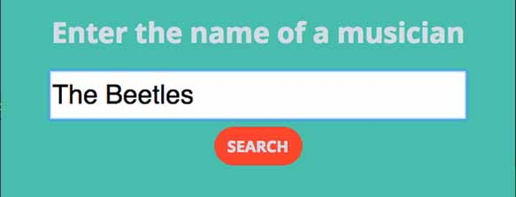
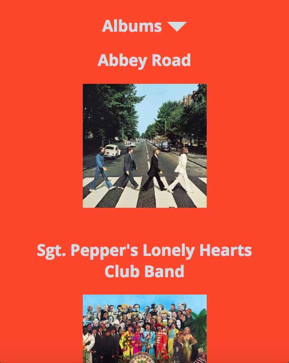
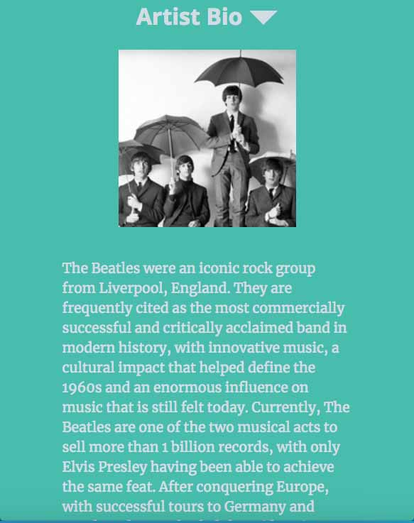

# Mumu

Click [here](https://pages.github.com/) to demo this application.

The music lover inside of me wanted to create something that allowed a user to do a simple search for an artist, and in return receive quick links to that artist's music. For this project, I used the last.fm API and the YouTube API. The last.fm API I found was very user friendly for new developers, it was very comprehensive. The YouTube API was also very easy to work with, and since YouTube is one of the ultimate go-to resources for content, it made sense to incorporate their API into this project.

This project incorporates HTML, CSS, Javascript, and jQuery. The last.fm and YouTube API's have been incorporated into the project as well.

This project took about one week from its initial conception, to version 1.0.
